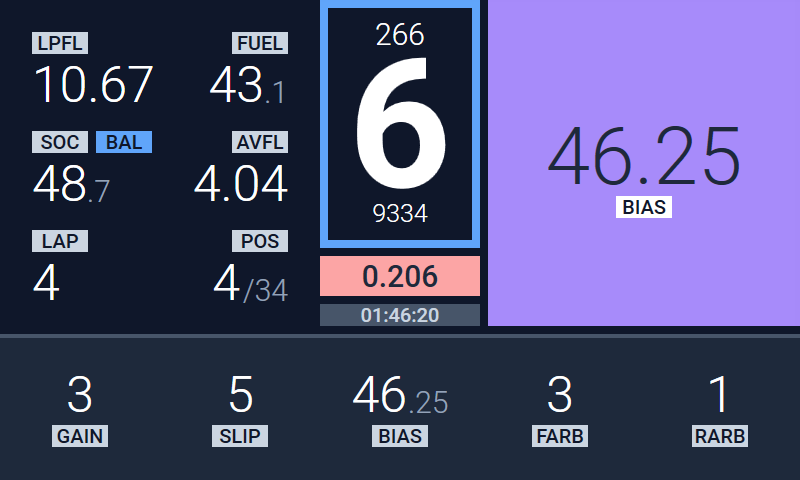

# MNZ Dashboard for SimHub & iRacing

## Installation
1. Download the latest release from [**Here**](https://github.com/simo026q/mnz-dashboard/releases).
2. If you are installing the dashboard for the first time then you need to install the fonts in the `Font` folder. Select them all and then right click and select `Install`. You can also download the font from [**Google Fonts**](https://fonts.google.com/specimen/Roboto).
3. Double click the `.simhubhash` file to import it into SimHub. Otherwise, open SimHub and go to `Dash Studio > Import Dashboard` and select the `.simhubhash` file.
4. Move the files from `C:\Program Files (x86)\SimHub\DashTemplates\MNZ Dashboard v2\JavascriptExtensions` into `C:\Program Files (x86)\SimHub\JavascriptExtensions`. It's recommended to delete the old files when copied.

## Fully supported cars

- GT3
  - Audi R8 LMS
  - BMW M4 GT3
  - Ferrari 488 GT3 EVO (maintained)
  - **[NEW]** Ferrari 296 GT3
  - Lamborghini Huracan GT3 EVO
  - McLaren MP4 GT3
  - Mercedes AMG GT3 Evo
  - Porsche 911 GT3 R (992)
- LMP2
- GTP/LMDh
  - **[NEW]** Acura ARX-06
  - Cadillac V-Series.R
  - BMW M Hybrid V8
  - **[NEW]** Porsche 963

It may work with other cars, but these are the ones that will be tested for new releases and added new features to. If you want to request a car to be added, please [**Open an Issue**](https://github.com/simo026q/mnz-dashboard/issues/new) and it might be added if enough people want it.

## Labels

The following is a list of what the different labels on the dashboard mean. Some of them may not be available for all cars or may have different some depending on the specific for car (this is done for realism and clarity).

### Universal

- **LPFL** - Remaining laps of fuel
- **FUEL** - Remaining amount of fuel in local unit
- **LAFL** - Last lap fuel usage
- **SOC** - State of charge (Hybrid)
- **AVFL** - Average fuel usage per lap
- **LAP** - Current lap / Remaining laps
- **POS** - Current class position / Total class opponents
- **CURR** - Current lap time
- **LAST** - Last lap time
- **PBST** - Personal session best lap time
- **SBST** - Session overall best lap time
- **SPD** - Speed in local unit
- **THR** - Throttle Input (0-100)
- **CLUT** - Clutch Input (0-100)

### Dials (Some names may depend on the car)

- **TC1 / GAIN / TC** - Traction control 1 setting
- **TC2 / SLIP** - Traction control 2 setting
- **ABS** - ABS setting
- **BIAS** - Brake bias setting
- **SHPE / MAP** - Throttle shape setting
- **FARB** - Front anti-roll bar setting
- **RARB** - Rear anti-roll bar setting
- **ESP** - Power steering assist

## Troubleshooting

A list of known problems and solutions.

### Some data values don't show
- Try updating to the latest version of SimHub and the dashboard. Dashboards are always tested with the latest version of SimHub available before release.

## Screenshots

